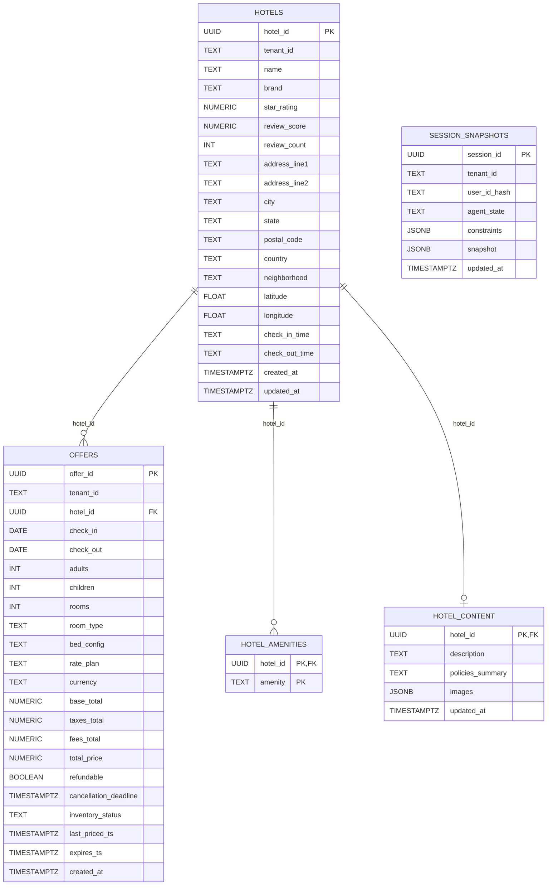

# Database diagram (ERD)

Notes:
- Source of truth: `db/migrations/alembic/versions/0001_init_schema.py`
- Multi-tenancy is modeled as a `tenant_id` column (enforced in app code as a single-tenant MVP).
- `session_snapshots` is not FK-linked to other tables (it stores agent session state as JSON).

